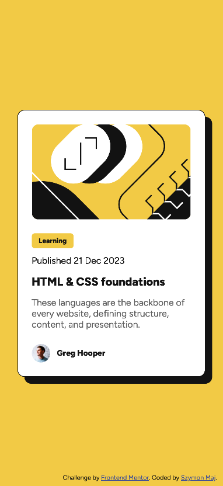
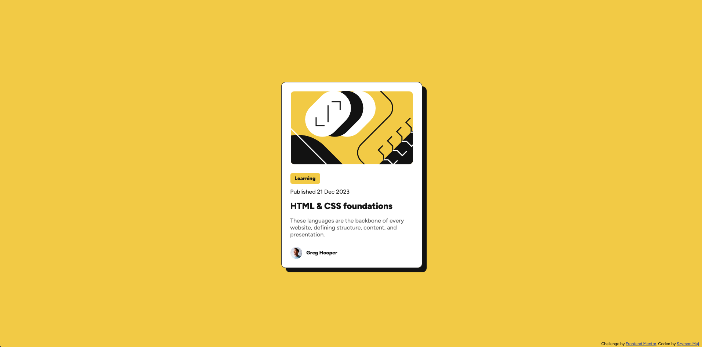

# Frontend Mentor - Blog preview card solution

This is a solution to the [Blog preview card challenge on Frontend Mentor](https://www.frontendmentor.io/challenges/blog-preview-card-ckPaj01IcS). Frontend Mentor challenges help you improve your coding skills by building realistic projects.

## Table of contents

- [Overview](#overview)
  - [The challenge](#the-challenge)
  - [Screenshot](#screenshot)
  - [Links](#links)
- [My process](#my-process)
  - [Built with](#built-with)
  - [What I learned](#what-i-learned)
  - [AI Collaboration](#ai-collaboration)
- [Author](#author)

## Overview

### The challenge

Users should be able to:

- See hover and focus states for all interactive elements on the page

### Screenshot

### Links

- Solution URL: [https://github.com/d4akon/fm-blog-preview-card](https://github.com/d4akon/fm-blog-preview-card)
- Live Site URL: [https://d4akon.github.io/fm-blog-preview-card/](https://d4akon.github.io/fm-blog-preview-card/)

## My process

### Built with

- Semantic HTML5 markup
- CSS custom properties
- Flexbox

### What I learned

After review from Claude and from Frontend Mentor AI, I've learned few new things.

- My img should be inside figure element.
- Date should have this semantic meaning <time datetime="2023-12-21"> 21 Dec 2023</time>.
- My h1 should insted be a element, because it was used to navigate.
- <article> now have footer, rather than simple div to have more semantic meaning.
- I've didn't add focus state for <a> at first, so I also have learned how, and why to add it.

### AI Collaboration

- What tools did I use?: Claude
- How did I use them?: Only for code review after submitting challenge.

## Author

- Frontend Mentor - [@d4akon](https://www.frontendmentor.io/profile/d4akon)
